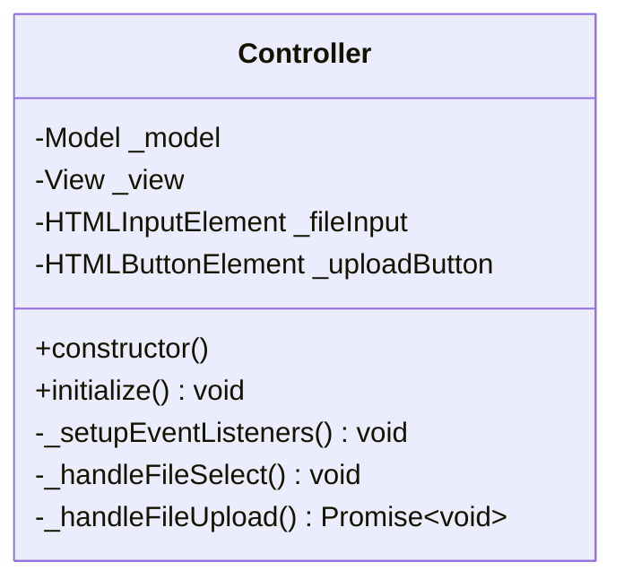
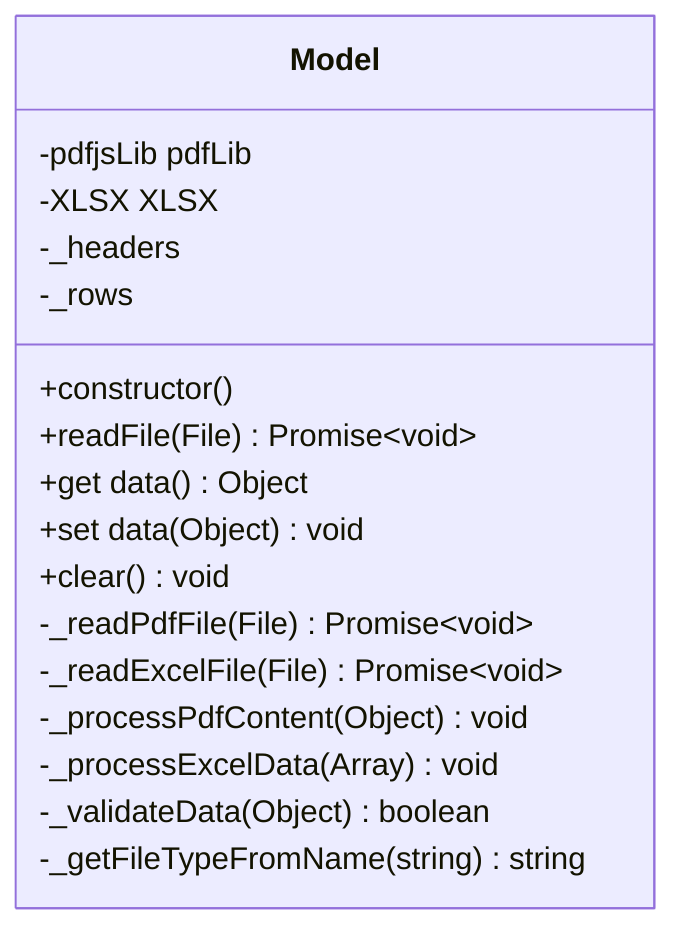
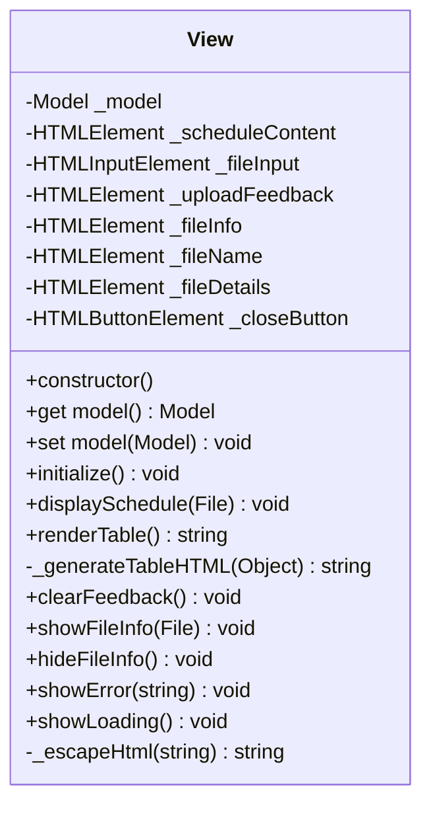

# Course Schedule Viewer

A web-based application that transforms PDF and Excel course schedules into HTML tables. Built using the Model-View-Controller (MVC) design pattern.

## Features

- PDF and Excel file support
- Real-time file processing
- Responsive table display
- File information display
- Error handling and validation
- Bootstrap-based UI

## Project Structure

```
├── app.html              # Main HTML file
├── app.css               # Custom styles
└── app/                  # Application code directory
    ├── app.model.js      # Data handling and file processing
    ├── app.view.js       # UI display and interactions
    ├── app.controller.js # Main application controller
```

## MVC Architecture

The application follows the Model-View-Controller (MVC) design pattern with clear separation of concerns:

- **Model**: Handles data processing and business logic
- **View**: Manages the presentation layer and user interface
- **Controller**: Coordinates between Model and View

## UML Class Diagrams

### Class Relationships


### Detailed Class Specifications

#### Controller



#### Model



#### View



## Dependencies

- [PDF.js](https://mozilla.github.io/pdf.js/) - PDF file parsing
- [SheetJS](https://sheetjs.com/) - Excel file parsing
- [Bootstrap 5.3.3](https://getbootstrap.com/) - UI framework
- [Bootstrap Icons](https://icons.getbootstrap.com/) - Icons

## Setup

1. Clone the repository
2. Open `app.html` in a web browser
3. Upload a PDF or Excel file containing a course schedule

## Usage

1. Click the "Choose File" button or drag and drop a file
2. Select a PDF or Excel file containing a course schedule
3. Click "Upload Schedule" to process the file
4. The schedule will be displayed as an HTML table
5. File information will be shown above the table

## Error Handling

The application handles various error scenarios:

- Invalid file types
- Empty or corrupted files
- PDF parsing errors
- Excel parsing errors
- Network issues

## Browser Support

- Chrome (latest)
- Firefox (latest)
- Safari (latest)
- Edge (latest)

## Notes

- The application uses client-side processing only
- No server-side components required
- All processing is done in the browser
- Supports both PDF and Excel file formats
