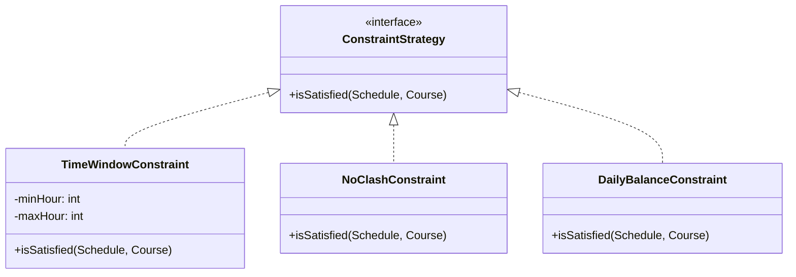
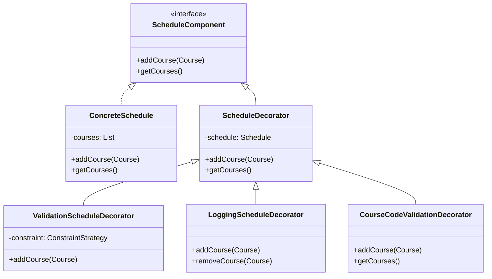
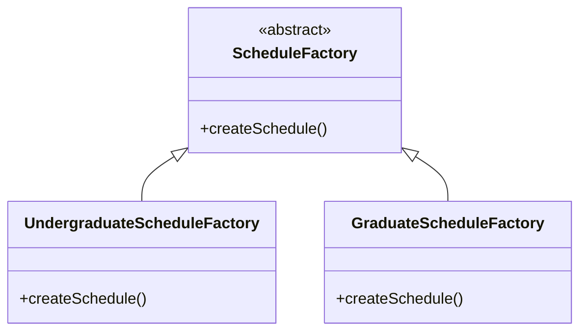

# University Course Scheduling System

A constraint-based weekly scheduling system for university courses that implements multiple design patterns to handle course scheduling requirements efficiently.


## Project Structure

```
├── src/                    # Source code directory
│   ├── strategy/          # Strategy pattern implementation
│   ├── decorator/         # Decorator pattern implementation
│   ├── factory/           # Factory pattern implementation
│   ├── model/             # Data models
│   ├── view/              # UI components
│   ├── controller/        # Application logic
│   └── util/              # Utility classes
├── resources/             # Resource files
│   └── *.txt             # Professor schedule files
└── web/                   # Web interface
    └── schedule_demo.html # Generated schedule view
```
## Screenshots


## Design Patterns Implementation

### 1. Strategy Pattern
The Strategy pattern is implemented for handling different scheduling constraints. Each strategy implements the `ConstraintStrategy` interface and provides specific validation logic:

- `TimeWindowConstraint`: Ensures courses are scheduled within specified time windows (e.g., between 9 AM and 5 PM)
- `NoClashConstraint`: Prevents scheduling conflicts by ensuring no two courses are scheduled at the same time on the same day
- `DailyBalanceConstraint`: Maintains a balanced daily schedule by limiting the number of courses per day (maximum 2 courses per day)

These strategies can be combined and applied during the schedule creation process to ensure all constraints are satisfied.

### 2. Decorator Pattern
The Decorator pattern is implemented to add functionality to schedule objects dynamically. The implementation includes:

- `ScheduleComponent`: The base interface defining core schedule operations
- `ConcreteSchedule`: The basic schedule implementation that maintains a list of courses
- `ScheduleDecorator`: The abstract decorator class that wraps a schedule object
- Concrete decorators:
  - `ValidationScheduleDecorator`: Validates courses against scheduling constraints before adding them
  - `LoggingScheduleDecorator`: Adds logging functionality for course additions and removals
  - `CourseCodeValidationDecorator`: Ensures only valid CENG courses (7-character codes starting with "CENG") are added to the schedule
  - `ValidationDecorator`: Basic validation for course properties (name, day, time)
  - `LoggingDecorator`: Basic logging for course operations

This pattern allows for flexible combination of different validations and logging features while maintaining a clean interface.

### 3. Factory Method Pattern
The Factory Method pattern is implemented to create different types of schedules with specific configurations. The implementation includes:

- `ScheduleFactory`: Abstract factory class defining the interface for schedule creation
- Concrete factories:
  - `UndergraduateScheduleFactory`: Creates undergraduate schedules with:
    - NoClashConstraint to prevent scheduling conflicts
    - Validation decorator for constraint checking
    - Logging decorator for operation tracking
  - `GraduateScheduleFactory`: Creates graduate schedules with:
    - TimeWindowConstraint (9 AM - 5 PM) for business hours
    - CourseCodeValidationDecorator for CENG course validation
    - Validation decorator for time constraints
    - Logging decorator for operation tracking

This pattern encapsulates the complex schedule creation logic and ensures consistent configuration for different schedule types.

## UML Class Diagrams

### Strategy Pattern


### Decorator Pattern


### Factory Pattern


## Features

1. **Input Validation**
   - Course code format validation (CENG + 3 digits)
   - Time slot format validation (HH:mm)
   - Day of week validation
   - Professor information tracking
   - Conflict detection

2. **Schedule Display**
   - HTML-based weekly schedule table
   - Color-coded course blocks (blue for undergraduate, purple for graduate)
   - Professor information display
   - Responsive design
   - Easy-to-read format

3. **Constraint Handling**
   - Lecturer preferences
   - Time window constraints
   - Course conflicts
   - Course code validation

4. **Logging and Monitoring**
   - Course addition/removal logging
   - Constraint violation reporting
   - Schedule modification tracking

## Setup and Usage

1. Clone the repository
2. Import the project into Eclipse
3. Ensure professor schedule files are in the `resources` directory
4. Run the application
5. View the generated schedule in `schedule_demo.html`
